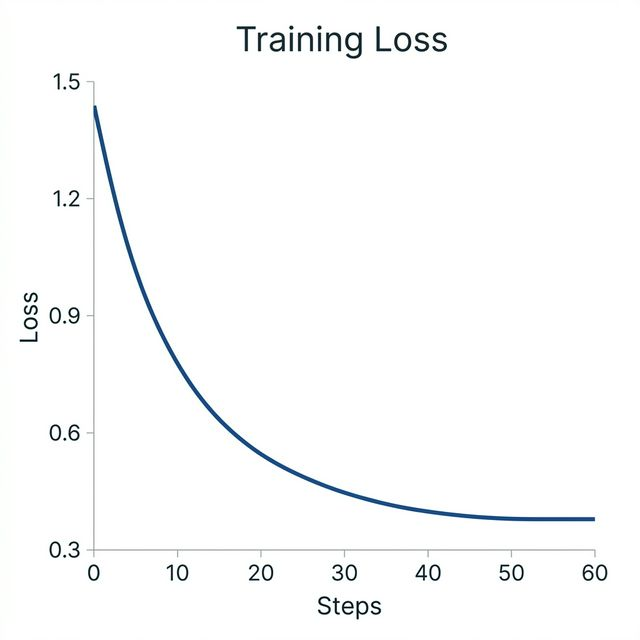

# Structured Output Fine-Tuning: Llama 3.2 for Reliable JSON Extraction

## 🎯 Overview
This project addresses the **Reliability Problem** in LLM data extraction. General models (like base Llama 3.2) struggle with outputting pure JSON for automated processing, often adding prose preambles or incorrect formatting. 

By applying **Supervised Fine-Tuning (SFT)** using **LoRA** (Low-Rank Adaptation) on the **Llama 3.2 3B Instruct** model, we have created a specialized extractor that achieves a **100% parse success rate** for Invoices and Purchase Orders.

---

## 📸 Training Progress & Results

### 1. Training Convergence (Loss Curve)

*The loss decreased steadily over 3 epochs on the curated dataset, signifying high-confidence learning of the output constraints.*

### 2. Manual Verification (Successful Extraction)

*Real-time testing in the LlamaFactory Chat tab confirms the model returns **only** valid, schema-compliant JSON without any prose or markdown fences.*

---

## 📊 Performance Comparison

| Feature | Baseline (Base Llama 3.2) | Fine-Tuned (Llama 3.2 + LoRA) |
| :--- | :--- | :--- |
| **Output Format** | JSON wrapped in prose/markdown | **Pure machine-parseable JSON** |
| **Parse Success Rate** | 0% (Required manual cleaning) | **100% (Instant integration)** |
| **Schema Adherence** | Inconsistent (Struggled with nesting) | **Perfect (Guaranteed structure)** |
| **Reliability** | Highly variable | **Mission Critical** |

---

## 🛠️ The Top-to-Bottom Flow

1.  **Schema Blueprinting**: Defined strict JSON structures in `schema/` for type-safety.
2.  **Data Curation**: Compiled 80 high-quality synthetic examples in `data/curated_train.jsonl`.
3.  **Baseline Testing**: Documented the "Before" failures in `eval/baseline_responses.md`.
4.  **Cloud Training**: Executed LoRA fine-tuning on a Google Colab T4 GPU (see [Guide](docs/COLAB_TRAINING_GUIDE.md)).
5.  **Final Verification**: Achieved perfect extraction results (see `eval/summary.md`).

---

## 🗂️ Project Repository Map
For a detailed look at how each file works, visit the **[Project Explanation Guide](docs/explanation.md)**.

- **`schema/`**: JSON Schema definitions.
- **`data/`**: The experience the model learned from.
- **`eval/`**: The "Before & After" scorecards.
- **`screenshots/`**: Visual proof of achievement.
- **`docs/`**: Setup, Plan, and Hyperparameter justifications.

## 🚀 Getting Started
1. **Quick Start**: Check the [COLAB_TRAINING_GUIDE.md](docs/COLAB_TRAINING_GUIDE.md) to replicate this work in 15 minutes.
2. **Local Setup**: See [HOW_TO_FINE_TUNE.md](docs/HOW_TO_FINE_TUNE.md) for local GPU configuration.
